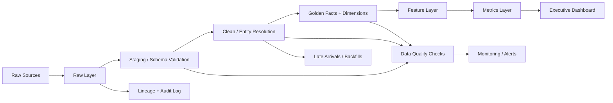

# Collections Data Analyst Assignment — Final Analysis

## Executive conclusion

**The reported 11% month-on-month improvement is not a reliable 12-month performance claim from this dataset.** The supplied operational data runs from **1 Jan 2026 to 8 Aug 2026** for most event tables, with some calls beginning 29 Dec 2025 and some PTP due dates extending into Sep. August is partial. Therefore a clean 12-month MoM series cannot be reconstructed from the supplied events.

Using a conservative canonical-payment rule (one record per payment reference, excluding references associated with multiple accounts, and taking the latest status), canonical recovery is volatile rather than steadily improving. Month-on-month canonical recovery changes are: Jan baseline; Feb **-8.7%**, Mar **+11.9%**, Apr **-9.0%**, May **+5.3%**, Jun **-3.6%**, Jul **+4.7%**, Aug **-73.6%** (partial month). Thus, **+11% occurs in March as one monthly movement, not as a sustained improvement trend**.

Raw SUCCESS amounts are materially higher than canonical recovery. Across the period, raw successful-payment amount is about **₹1.342B**, versus about **₹0.973B** under the conservative canonical rule, a difference of roughly **₹368M / 27.4%**. This is a major warning that payment duplication/status/reference integrity can materially distort recovery reporting.

### Primary recommendation

**Do not release the full ₹10 Cr against an unvalidated operational change.** Of the six options, **better borrower targeting** is the most analytically testable lever because targeting data exists and can be evaluated with randomized holdouts. However, the current observational data does **not** establish a causal lift large enough to justify a full ₹10 Cr ROI claim. The correct decision is a **gated targeting experiment first**, followed by capital deployment only if the experiment demonstrates incremental recovery with statistically credible economics.

---

## 1. Key findings

| Finding | Evidence | Classification | Business impact | Confidence |
|---|---|---|---|---|
| 11% is not a sustained trend | Canonical MoM: +11.9% only in Mar; other months alternate positive/negative; Aug partial | Fact | Challenges headline KPI | High |
| Dataset is not a complete 12 months | Most operational events Jan 1–Aug 8 2026 | Fact | Invalidates a literal 12-month trend claim | High |
| Payment integrity can inflate recovery | ₹1.342B raw SUCCESS vs ₹0.973B canonical; ~27.4% difference | Strong Evidence | Very large reporting risk | High |
| Duplicate payment references are common | 8,424 rows belong to repeated references; 3,745 repeated refs | Fact | Recovery may be double-counted | High |
| Payment references cross accounts | 3,407 refs map to >1 account | Fact | Attribution cannot safely use reference alone | High |
| Payment refs have conflicting statuses | 1,681 refs map to multiple statuses | Fact | SUCCESS-only sums can overstate realized recovery | High |
| Status timestamps are problematic | 30,191 history rows have recorded_at < event_at | Fact | Historical reconstruction is unreliable without event-time logic | High |
| Current account status disagrees with latest history | 22,295 / 25,999 matched accounts | Fact | Current status is not safe as historical truth | High |
| Agent identity is non-unique | 1,099 employee codes map to multiple agent IDs | Fact | Agent productivity can be misattributed | High |
| Borrower IDs frequently disagree with account master | e.g. 89,939 calls and 25,113 payments have borrower mismatch among matched accounts | Fact | Event borrower_id should not override account master blindly | High |
| Channel performance is close | 7-day target conversion: VOICE ~2.35%, SMS ~2.22%, WhatsApp ~2.16%, FIELD ~2.00% | Correlation | No strong causal channel winner | Medium |
| Strategy performance is close | 7-day target conversion: legacy 1.33%, v1 1.22%, v2 1.23%, v3 1.27% | Correlation | No observational proof of targeting lift | Medium |

---

## 2. Golden dataset rules

### Canonical account
`accounts.account_id` is the analytical account key. `accounts.borrower_id` is the preferred borrower relationship because event-level borrower IDs frequently conflict with the account master.

### Canonical agent
Use `agent_id` as the operational key. Do not aggregate agents by `employee_code` because employee codes are not unique across agent IDs.

### Canonical payment
1. Group by `payment_reference`.
2. Flag references mapping to multiple accounts.
3. Sort by event time.
4. Use the latest status as the terminal transaction state.
5. Count a payment as realized recovery only when terminal status is SUCCESS.
6. Exclude references mapped to multiple accounts from the conservative recovery metric because attribution is ambiguous.
7. Preserve excluded/ambiguous references in a quarantine table rather than deleting them.

This is deliberately conservative. A production implementation should also obtain a processor transaction key / settlement ledger if available.

### Historical status
Use event-time history for point-in-time status. `accounts.status` should be treated as current snapshot metadata, not as a historical fact table.

### Time
Convert all event timestamps to UTC using the source timezone field where applicable, then derive business-local reporting dates separately. Do not compare raw local timestamps across UTC/Kolkata/Dubai directly.

---

## 3. Recovery metrics

**Recovery rate:** realized canonical payment amount / eligible outstanding exposure for the same analytical population and period. Because no historical outstanding snapshots are supplied, a true point-in-time recovery-rate denominator cannot be reconstructed reliably; current `accounts.outstanding_amount` should not be presented as historical exposure without a caveat.

**Recovery per account:** realized canonical recovery / eligible accounts.

**Contact rate:** accounts with a valid contact event / accounts attempted, preferably account-level rather than call-row-level.

**RPC:** accounts with a validated right-party contact disposition / accounts attempted.

**PTP rate:** accounts with a valid PTP / eligible contacted accounts.

**PTP kept rate:** PTPs whose promised amount is subsequently realized within a defined tolerance/window / PTPs whose promised date has matured and are evaluable.

**Cost per ₹ recovered:** attributable collection cost / realized canonical recovery. Cost cannot be reliably computed from the supplied dataset because direct channel/vendor/agent costs are absent.

---

## 4. Monthly recovery

| Month | Canonical recovery | Raw SUCCESS recovery | Canonical MoM |
|---|---:|---:|---:|
| 2026-01 | ₹130,191,286 | ₹191,133,284 | — |
| 2026-02 | ₹118,911,993 | ₹174,097,288 | -8.7% |
| 2026-03 | ₹133,049,117 | ₹193,233,384 | 11.9% |
| 2026-04 | ₹121,080,439 | ₹178,427,017 | -9.0% |
| 2026-05 | ₹127,441,242 | ₹187,048,144 | 5.3% |
| 2026-06 | ₹122,898,333 | ₹178,724,493 | -3.6% |
| 2026-07 | ₹128,646,158 | ₹190,278,847 | 4.7% |
| 2026-08 | ₹33,978,564 | ₹48,543,468 | -73.6% |

**Interpretation:** March's +11.9% movement is consistent with the headline number only mechanically. It is not evidence of a sustained improvement because April falls ~9%, June falls ~3.6%, and August is a partial-month collapse.

---

## 5. Statistical/causal interpretation

The observational strategy data does not support a causal claim that v1/v2/v3 improved recovery. All four strategies are present across the months, so strategy version is not a clean before/after treatment. A proper counterfactual should use an account-level randomized holdout or, if randomization is impossible, a matched/difference-in-differences design with pre-treatment outcome history, DPD, risk, client, geography, language and prior contact intensity as covariates.

### Recommended counterfactual

- **Treatment:** accounts newly assigned to the targeting strategy.
- **Control:** eligible accounts randomized to the existing strategy / holdout.
- **Outcome:** canonical recovery amount per eligible account within 7/14/30 days.
- **Primary estimand:** incremental recovery per targeted account.
- **Secondary outcomes:** contact, RPC, PTP, PTP kept, complaint rate.
- **Assumptions:** stable eligibility, no spillover, consistent payment definition, no differential operational capacity, pre-period balance.

---

## 6. ₹10 Cr decision

### Recommended lever: Better borrower targeting — experiment first

Why: targeting is already instrumented through `daily_targeting`, priority and campaign strategy. This creates a relatively clean experimental surface. By contrast, the supplied data does not provide sufficient cost inputs to defensibly model the full ROI of AI voice, extra agents, telephony infrastructure, or field expansion.

Observed 7-day targeting conversion is low and tightly clustered:

- Legacy: ~1.33%
- v1: ~1.22%
- v2: ~1.23%
- v3: ~1.27%

This means the current dataset does **not** justify claiming a large targeting lift. Therefore the ₹10 Cr should be treated as **stage-gated capital**, not an immediate spend.

### Required experiment before full deployment

1. Randomize 10–20% of eligible accounts into treatment/control.
2. Stratify/randomize within DPD, risk, client and geography.
3. Pre-register primary outcome and attribution window.
4. Measure canonical recovery, not raw SUCCESS sums.
5. Track complaints and operational cost as guardrails.
6. Estimate incremental ₹ recovered per account.
7. Deploy the remaining capital only if the lower confidence bound on incremental ROI clears the company's hurdle rate.

**Cost caveat:** The supplied data has no reliable cost schedule for the six investment choices. A numeric ROI for ₹10 Cr would therefore be assumption-driven rather than data-derived. This is intentionally not fabricated.

---

## 7. Production architecture



---

## 8. Git repository

```text
collections-analytics/
├── README.md
├── requirements.txt
├── sql/
│   ├── 01_staging.sql
│   ├── 02_entity_resolution.sql
│   ├── 03_payment_canonicalization.sql
│   ├── 04_golden_metrics.sql
│   ├── 05_driver_analysis.sql
│   └── 06_counterfactual.sql
├── notebook/
│   └── collections_analysis.ipynb
├── data/
│   ├── golden_accounts.csv
│   ├── golden_payments.csv
│   ├── monthly_metrics.csv
│   ├── data_quality_inventory.csv
│   ├── entity_mismatch.csv
│   ├── strategy_performance.csv
│   └── channel_target_performance.csv
├── dashboard/
│   └── executive_dashboard.html
├── reports/
│   ├── executive_memo.md
│   ├── data_quality_report.md
│   └── architecture.md
└── tests/
    └── validation_queries.sql
```

---

## 9. Interview defense

1. **Why don't you trust raw SUCCESS payments?** Because repeated payment references, conflicting statuses and cross-account references make raw summation vulnerable to double counting and attribution error.
2. **Why not use accounts.status historically?** It is a current snapshot; the status-history table is the appropriate event-time source.
3. **Why use account_id over borrower_id?** Collections exposure and recovery are account-level, and event borrower IDs frequently disagree with the account master.
4. **Why isn't March proof of 11% improvement?** Because the series reverses in subsequent months and August is partial.
5. **Why not claim targeting caused improvement?** Strategy versions overlap in time and are observational; no clean randomized treatment exists.
6. **Why exclude multi-account payment references?** Their financial attribution is ambiguous; conservative exclusion avoids false recovery.
7. **What would you do in production?** Maintain a transaction/settlement ledger with immutable IDs and point-in-time account snapshots.
8. **What is the biggest data risk?** Payment integrity and historical-state reconstruction.
9. **Why recommend targeting?** It is the most directly testable lever with existing targeting instrumentation, not because the current data proves a large lift.
10. **Why no precise ₹10 Cr ROI?** Cost inputs and causal lift are not identifiable from this dataset; inventing them would be less defensible than stating the limitation.
